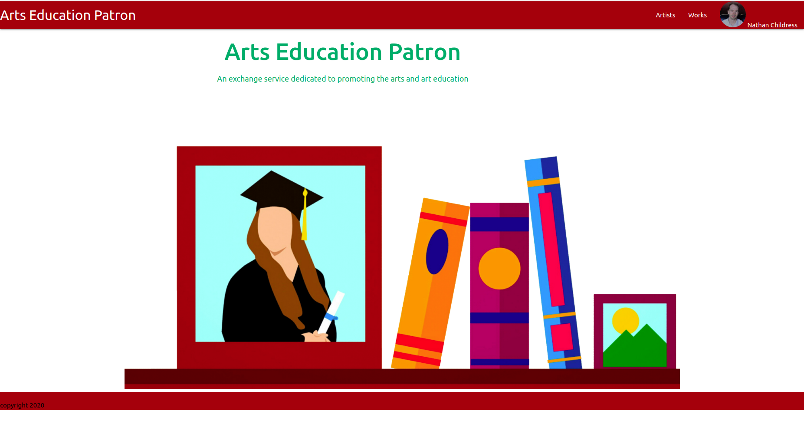

# Arts Education Patron

The purpose of this project is to try and create a portfolio and freelance work exchange for early artists and their support network.

## Where to see it
My project is initially setup on Heroku and can be [found here](https://artseducationpatron.herokuapp.com/)

## Technologies Used
- JS
- Node.JS
- MongoDB
- Heroku
- Express
- MVC/RESTful responses
- Google Oauth

## Future Goals
For this project to be useful to our community there needs to be a social distribution method. It should be simple enough to hook into FB, Twitter, LinkedIn and Instagram to be able to publish artist artworks and patrons to publish commissions they like to their feed. However that is beyond the scope of our MVP. I'd like to tackle it as it's integral for both parties to get the most out of the service.